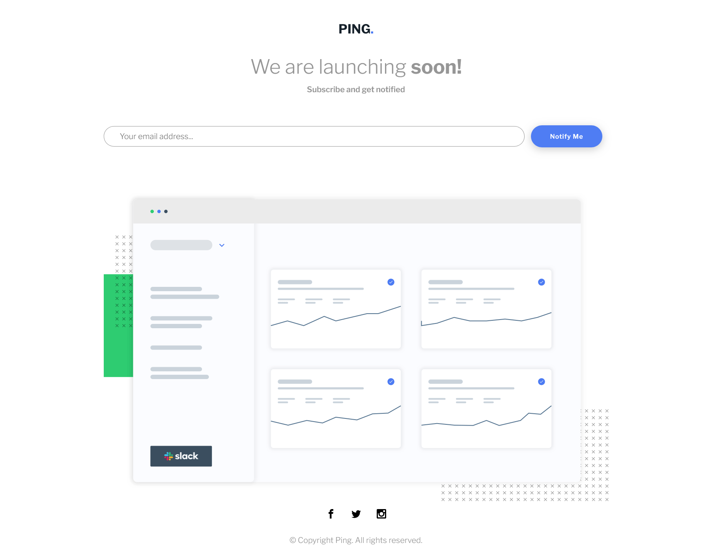

# Frontend Mentor - Ping coming soon page solution

This is a solution to the [Ping coming soon page challenge on Frontend Mentor](https://www.frontendmentor.io/challenges/ping-single-column-coming-soon-page-5cadd051fec04111f7b848da). Frontend Mentor challenges help you improve your coding skills by building realistic projects. 

## Table of contents

- [Overview](#overview)
  - [The challenge](#the-challenge)
  - [Screenshot](#screenshot)
  - [Links](#links)
- [My process](#my-process)
  - [Built with](#built-with)
  - [What I learned](#what-i-learned)
  - [Continued development](#continued-development)
  - [Useful resources](#useful-resources)
- [Author](#author)
- [Acknowledgments](#acknowledgments)


## Overview

### The challenge

Users should be able to:

- View the optimal layout for the site depending on their device's screen size
- See hover states for all interactive elements on the page
- Submit their email address using an `input` field
- Receive an error message when the `form` is submitted if:
	- The `input` field is empty. The message for this error should say *"Whoops! It looks like you forgot to add your email"*
	- The email address is not formatted correctly (i.e. a correct email address should have this structure: `name@host.tld`). The message for this error should say *"Please provide a valid email address"*

### Screenshot



Desktop layout.

### Links

- Solution URL: [Github repository](https://github.com/funficient/fem-ping-coming-soon)
- Live Site URL: [Github pages](https://funficient.github.io/fem-ping-coming-soon/)

## My process

### Built with

- Semantic HTML5 markup
- CSS custom properties
- Flexbox
- CSS Grid
- Containerless
- Javascript

### What I learned

This is the first time using regular expressions and validation in a project.  

I also tried to use a mostly containerless setup to reduce the number of divs used by setting up a basic page layout with grid. 

```
.content-grid {
  display: grid;
  grid-template-columns:  100px [breakout-start] 100px [content-start] 1fr [content-end] 100px [breakout-end] 100px ;
  place-items: center;
  text-align: center;
}

.content-grid > * {
  grid-column: content;
}

.content-grid > .breakout {
  grid-column: breakout;
}

```
### Continued development

Still figuring out the best way to validate and display the error messages.

### Useful resources


## Author

- Website - [Kate Dames](https://www.funficient.com)
- Frontend Mentor - [@funficient](https://www.frontendmentor.io/profile/funficient)


## Acknowledgments

Thanks for all the feedback!